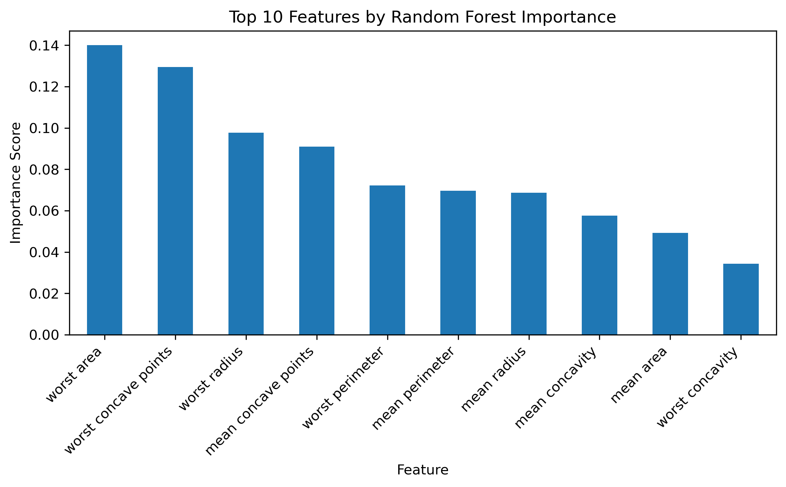

# Feature Selection Demonstration

This project demonstrates different **feature selection techniques** using the Breast Cancer Wisconsin dataset.  
The goal is not only to measure model accuracy, but also to show how feature selection can improve **interpretability** and **model transparency**.

---

## 📂 Project Structure
- `feature_selection.ipynb` → Main notebook with all code, explanations, and results.  
- `feature_importances.png` → Visualization of the top 10 features selected by Random Forest.  
- `README.md` → Project overview.

---

## 🚀 Methods Applied
1. **Baseline Model (Logistic Regression)**  
   - Achieved ~98% accuracy without feature selection.  
   - Serves as a reference point.  

2. **Wrapper Method: Recursive Feature Elimination (RFE)**  
   - Selects the most relevant features iteratively.  

3. **Embedded Method: Random Forest Feature Importance**  
   - Provides model-based feature ranking.  
   - Visualized in `feature_importances.png`.  

---

## 📊 Results & Insights
- The baseline model already performed very well (~98% accuracy).  
- Feature selection **did not improve accuracy** on this dataset (because features are already strong).  
- The main value of feature selection lies in **interpretability and feature ranking**, not just raw performance.  

---

## 📊 Top 10 Features by Random Forest

| Rank | Feature                | Importance Score |
|------|------------------------|------------------|
| 1    | worst area             | 0.140016         |
| 2    | worst concave points   | 0.129530         |
| 3    | worst radius           | 0.097696         |
| 4    | mean concave points    | 0.090885         |
| 5    | worst perimeter        | 0.072226         |
| 6    | mean perimeter         | 0.069574         |
| 7    | mean radius            | 0.068676         |
| 8    | mean concavity         | 0.057638         |
| 9    | mean area              | 0.049172         |
| 10   | worst concavity        | 0.034340         |

---

## 🔍 Feature Importance Visualization

Below is the visualization of the **top 10 features** ranked by Random Forests:

---

## ✅ Conclusion
Feature selection is a critical step when working with high-dimensional or noisy data.  
Even when accuracy remains unchanged, it helps us understand **which features truly matter** – a key skill for real-world machine learning projects.
